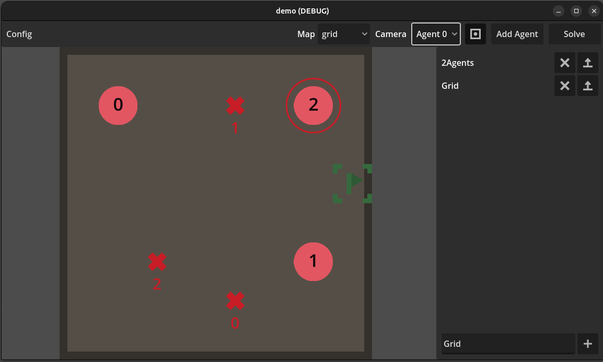

# Multi-Agent path finding with SAT and GODOT4

This project demonstrates the use of SAT solvers to schedule path finding in multi agent systems.
The implementation is based on [Efficient SAT Approach to Multi-Agent Path Finding
under the Sum of Costs Objective](http://surynek.net/publications/files/Surynek-Felner-Stern-Boyarski_Efficient-Cost-Encoding_WoMAPF-2016.pdf)

# UI


The demonstrator provides a playground for simulating different cell based agent paths.

## Features

- UI for adding and managing agents
- Store agent setups in presets to load them later
- Selection of maps including DAO-maps mentioned in the paper

## Build (linux)

```bash
git submodule update --init
```

Building glucose

```bash
cd glucose
mkdir build
cd build
cmake .. -DCMAKE_POSITION_INDEPENDENT_CODE=ON
cmake --build .
```

Building MAPF plugin (gdext)

```bash
cd ..
godot --dump-extension-api
cd godot-cpp
scons platform=linux custom_api_file=../extension_api.json
cd ..
scons platform=linux
```
